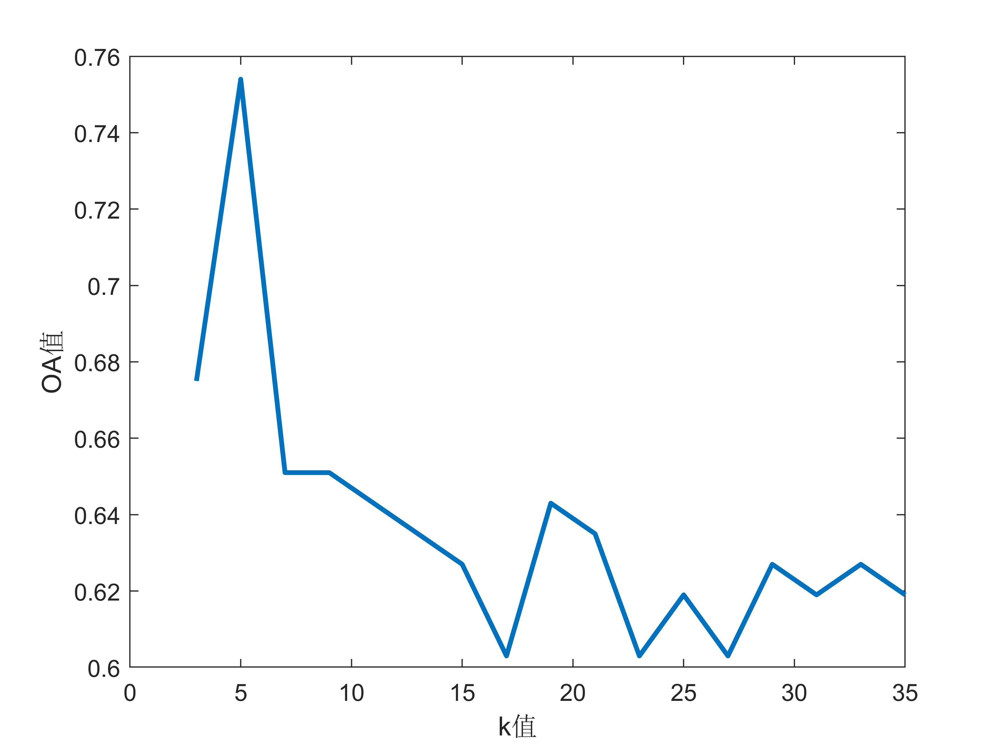
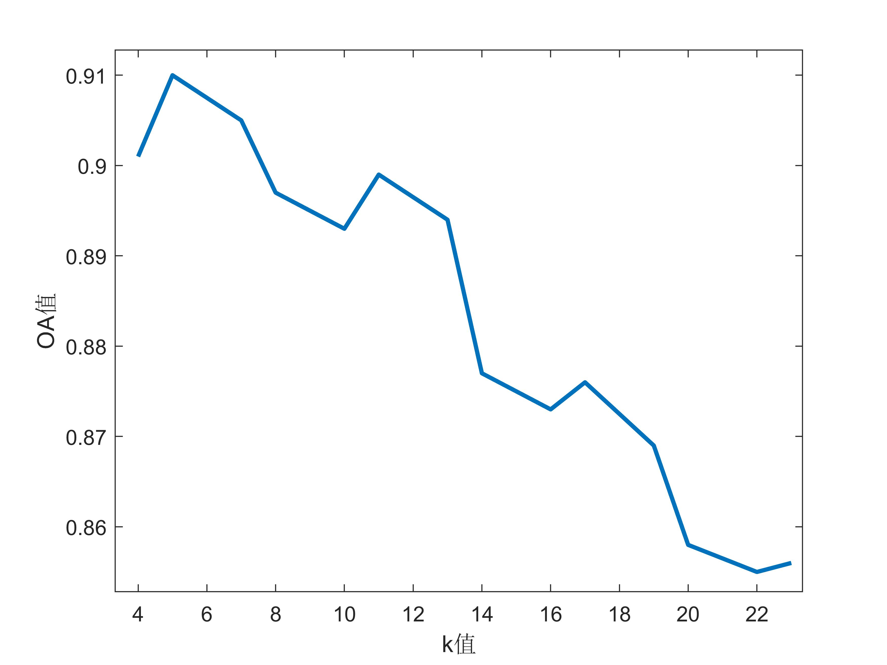

## Fisher线性判别+KNN算法分类

### 环境

- pycharm专业版2019.3.3

- python3.7.4
- 外部库：numpy=1.16.5；sklearn=0.21.3；matplotlib=3.3.1；openpyxl=3.0.0


### 原理简介
将一个一个复杂的高维分类问题，先通过fisher线性判别分析进行降维，降到低纬之后，再通过KNN算法进行分类

### 一些计算公式

#### 在n维X空间

- 各类样本均值向量$\mu_i$:

$$
\mu_{i}=\dfrac{1}{N_{i}}\sum _{x_{j}\in \Omega _{i}}x_{j},i=1,2
$$

- 各类类内离散度矩阵$S_{i}$:

$$
S _{i}=\sum _{x_{j}\in \Omega _{i}}\left( x_{j}-\mu_{i}\right) \left( x_{j}-\mu _{i}\right) ^{T},i=1,2
$$

- 总类内离散度矩阵$S_{w}$:

$$
S_{w}=\sum _{x_{j}\in \Omega _{i}}S_{i},i=1,2
$$

- 二分类情况下样本类间离散度矩阵$S_{b}$:

$$
S_{b}=(\mu_{1}-\mu_{2})(\mu_{1}-\mu_{2})^{T}
$$

- 多分类情况下的样本类间离散度矩阵$S_b$:
  $$
  S_b=\sum_{i=1,2,...c}{N_i}(\mu_i-\mu)(\mu_i-\mu)^{T}
  $$
  其中$\mu$是所有样本的均值

#### Y空间

- 各类样本均值$\overline{\mu _{i}}$:

$$
\overline{\mu _{i}}=\dfrac{1}{N_{i}}\sum _{y_{j}\in \psi _{i}}y_{j},i=1,2
$$

- 各类内离散度$\overline{S^{2}_{i}}$:
$$
\overline{S_{i}}^{2}=\sum _{y_{j}\in \psi _{i}}\left( y_{j}-\overline{\mu}_{i}\right) ^{2},i=1,2
$$

- 二分类情况下降到一维最佳投影方向$\omega^*$:
  $$
  \omega^{*}={S_{\omega}}^{-1}(\mu_{1}-\mu_{2})
  $$


- 降到二维的最佳投影方向$\omega^{*}$:
  $$
  S_{w}^{-1}S_{b}\omega^{*}=\lambda\omega^{*}
  $$
  根据式子(9)计算出特征值$\lambda$，取最大的前两个特征值所对应的特征向量，将其组合在一起，即为所求的最佳投影方向，式(9)中的$S_b$由式(5)计算得来

#### 评价指标

- 总体分类精度OA：
$$
  \frac{所有判断正确的样本数}{所有测试样本数}\times100\%
$$

- 类别分类精度AA:
  $$
  \frac{某一类中判断正确的样本数}{该类参与测试的样本数}\times100\%
  $$

- kappa系数:
  $$
  \frac{OA-pe}{1-pe}
  $$

- pe:
  $$
  \frac{\sum{(某类参与测试的样本数\times{被判断为该类的测试样本数})}}{所有的测试样本数^2}
  $$

### 数据标准化

由于两种数据集中特征的量纲都一样，所以为了消除量纲，将每个特征的数值除以该特征中的最大值即可，这样将所有特征数值映射到了区间[0,1]之间

### 划分训练集和测试集

利用sklearn包中的train_test_split函数进行训练集和测试集的划分，其中训练集占比40%，测试集占比60%。

其中train_test_split函数的一般形式如下：

```python
X_train,X_test, y_train, y_test =train_test_split(train_data,train_target,test_size=0.4, random_state=0)
```

参数解释：

- **train_data：**所要划分的样本特征集
- **train_target：**所要划分的样本结果集
- **test_size：**测试样本占比，如果是整数的话就是样本的数量
- **random_state：**是随机数的种子

- **随机种子：**其实就是该组随机数的编号，在需要重复试验的时候，保证得到一组一样的随机数

通过该函数，只要每次传入不同的随机种子，就可以得到不同的训练集、测试集

### 分类策略

1. sonar数据集

   sonar数据集为一个二分类问题，只需要计算出最优投影方向，投影后：

   - 方案一：将样本降到一维，计算出决策点，再进行分类
   - 方案二：将样本降到2维，通过KNN算法进行分类

2. iris数据集

   iris数据集为一个三分类问题
   
   - 方案一：可以将其转化为三个二分类问题进行分类，具体分类思路如下：
   
     ```mermaid
     graph TB
            start[测试样本] --通过第1,2类样本的决策函数--> input[样本全被标记为0或者1]
            input --通过第1,3类样本的决策函数--> conditionA{样本是否被标记为0}
            conditionA -- YES --> printA[将标记为0的样本分为第一类]
            conditionA -- NO --> inputB[二三两类数据]
            inputB --通过第2,3类样本的决策函数--> conditionB{样本是否被标记为1}
            conditionB --YES--> printB[将标记为1的样本分为第二类]
            conditionB --NO--> printC[将标记为2的样本分为第三类] 
     ```
   
   - 方案二：将样本降到二维，再通过KNN算法进行分类
   
   

### K值的选择

KNN分类算法中，需要我们提前指定k的值，本次试验的k值选取过程如下：

- 先构建好分类器

- 对于iris数据集，k分别取值为$4,5,7,8,10,11,13,14,16,17,19,20,22,23$，求出对应的OA值，取最大的OA值对应的k值为最终的k值

- 对于sonar数据集，k分别取值为$3,5,7,9,11,13,15,17,19,21,23,25,27,29,31,33,35$，求出对应的OA值，取最大的OA值对应的k值为最终的k值


得到的结果如下：

- sonar：



- iris：



由上图可知，两数据集都取**k=5**分类效果最好


### 分类结果展示


#### sonar数据集

1. **分类方案1：**

   |  试验次数  | 整体分类精度OA | kappa系数 | 第一类类别分类精度AA | 第二类类别分类精度AA |
   | :--------: | :------------: | :-------: | :------------------: | :------------------: |
   |     1      |     0.603      |   0.213   |        0.678         |        0.537         |
   |     2      |     0.690      |   0.370   |        0.559         |        0.806         |
   |     3      |     0.690      |   0.380   |        0.695         |        0.687         |
   |     4      |     0.587      |   0.171   |        0.559         |        0.612         |
   |     5      |     0.690      |   0.385   |        0.763         |        0.627         |
   |     6      |     0.698      |   0.389   |        0.610         |        0.776         |
   |     7      |     0.675      |   0.355   |        0.763         |        0.597         |
   |     8      |     0.683      |   0.371   |        0.780         |        0.597         |
   |     9      |     0.706      |   0.410   |        0.678         |        0.731         |
   |     10     |     0.690      |   0.383   |        0.729         |        0.657         |
   |     11     |     0.643      |   0.284   |        0.627         |        0.657         |
   |     12     |     0.730      |   0.467   |        0.847         |        0.627         |
   |     13     |     0.643      |   0.279   |        0.576         |        0.701         |
   |     14     |     0.683      |   0.353   |        0.542         |        0.806         |
   |     15     |     0.675      |   0.351   |        0.712         |        0.642         |
   |     16     |     0.603      |   0.198   |        0.525         |        0.672         |
   |     17     |     0.794      |   0.589   |        0.847         |        0.746         |
   |     18     |     0.611      |   0.223   |        0.627         |        0.597         |
   |     19     |     0.627      |   0.246   |        0.542         |        0.701         |
   |     20     |     0.778      |   0.551   |        0.712         |        0.836         |
   |     21     |     0.675      |   0.358   |        0.797         |        0.567         |
   |     22     |     0.683      |   0.365   |        0.695         |        0.672         |
   |     23     |     0.754      |   0.500   |        0.644         |        0.851         |
   |     24     |     0.738      |   0.475   |        0.729         |        0.746         |
   |     25     |     0.730      |   0.460   |        0.746         |        0.716         |
   |     26     |     0.667      |   0.335   |        0.695         |        0.642         |
   |     27     |     0.667      |   0.333   |        0.678         |        0.657         |
   |     28     |     0.706      |   0.417   |        0.780         |        0.642         |
   |     29     |     0.754      |   0.508   |        0.780         |        0.731         |
   |     30     |     0.730      |   0.462   |        0.780         |        0.687         |
   | **平均值** |   **0.687**    | **0.373** |      **0.690**       |      **0.684**       |

   

2. **分类方案2：**

   |  试验次数  | 整体分类精度OA | **kappa系数** | 第一类类别分类精度AA | 第二类类别分类精度AA |
   | :--------: | :------------: | :-----------: | :------------------: | :------------------: |
   |     1      |     0.627      |     0.252     |        0.610         |        0.642         |
   |     2      |     0.603      |     0.205     |        0.593         |        0.612         |
   |     3      |     0.754      |     0.505     |        0.729         |        0.776         |
   |     4      |     0.643      |     0.278     |        0.559         |        0.716         |
   |     5      |     0.548      |     0.087     |        0.475         |        0.612         |
   |     6      |     0.683      |     0.361     |        0.644         |        0.716         |
   |     7      |     0.683      |     0.361     |        0.644         |        0.716         |
   |     8      |     0.690      |     0.377     |        0.644         |        0.731         |
   |     9      |     0.603      |     0.200     |        0.542         |        0.657         |
   |     10     |     0.690      |     0.379     |        0.678         |        0.701         |
   |     11     |     0.683      |     0.361     |        0.644         |        0.716         |
   |     12     |     0.508      |     0.014     |        0.492         |        0.522         |
   |     13     |     0.683      |     0.361     |        0.644         |        0.716         |
   |     14     |     0.595      |     0.186     |        0.559         |        0.627         |
   |     15     |     0.556      |     0.108     |        0.525         |        0.582         |
   |     16     |     0.627      |     0.256     |        0.661         |        0.597         |
   |     17     |     0.587      |     0.170     |        0.542         |        0.627         |
   |     18     |     0.683      |     0.363     |        0.661         |        0.701         |
   |     19     |     0.690      |     0.379     |        0.678         |        0.701         |
   |     20     |     0.563      |     0.112     |        0.424         |        0.687         |
   |     21     |     0.746      |     0.484     |        0.627         |        0.851         |
   |     22     |     0.571      |     0.138     |        0.525         |        0.612         |
   |     23     |     0.651      |     0.297     |        0.610         |        0.687         |
   |     24     |     0.595      |     0.190     |        0.593         |        0.597         |
   |     25     |     0.675      |     0.341     |        0.576         |        0.761         |
   |     26     |     0.603      |     0.198     |        0.525         |        0.672         |
   |     27     |     0.635      |     0.261     |        0.542         |        0.716         |
   |     28     |     0.587      |     0.173     |        0.576         |        0.597         |
   |     29     |     0.667      |     0.331     |        0.644         |        0.687         |
   |     30     |     0.611      |     0.214     |        0.525         |        0.687         |
   | **平均值** |   **0.635**    |   **0.365**   |      **0.590**       |      **0.674**       |


#### iris数据集

1. **分类方案1：**

   |  实验次数  | 整体分类精度OA | kappa系数 | 类别分类精度AA（依次为第1，2，3类） |
   | :--------: | :------------: | :-------: | :---------------------------------: |
   |     1      |     0.900      |   0.850   |      1.00 	0.767 	0.933       |
   |     2      |     0.911      |   0.867   |      1.00 	0.800 	0.933       |
   |     3      |     0.833      |   0.750   |      1.00 	0.800 	0.700       |
   |     4      |     0.956      |   0.933   |      1.00 	0.900 	0.967       |
   |     5      |     0.922      |   0.883   |      1.00 	0.900 	0.867       |
   |     6      |     0.967      |   0.950   |      1.00 	0.900 	1.000       |
   |     7      |     0.900      |   0.850   |      1.00 	0.800 	0.900       |
   |     8      |     0.944      |   0.917   |      1.00 	0.900 	0.933       |
   |     9      |     0.933      |   0.900   |      1.00 	0.967 	0.833       |
   |     10     |     0.956      |   0.933   |      1.00 	0.933 	0.933       |
   |     11     |     0.900      |   0.850   |      1.00 	0.833 	0.867       |
   |     12     |     0.822      |   0.733   |      1.00 	0.667 	0.800       |
   |     13     |     0.833      |   0.75    |      1.00 	0.800 	0.700       |
   |     14     |     0.967      |   0.950   |      1.00 	0.933 	0.967       |
   |     15     |     0.878      |   0.817   |      1.00 	0.633 	1.000       |
   |     16     |     0.922      |   0.883   |      1.00 	0.933 	0.833       |
   |     17     |     0.644      |   0.467   |      1.00 	0.433 	0.500       |
   |     18     |     0.900      |   0.850   |      1.00 	0.833 	0.867       |
   |     19     |     0.900      |   0.850   |      1.00 	0.867 	0.833       |
   |     20     |     0.889      |   0.833   |      1.00 	0.867 	0.800       |
   |     21     |     0.900      |   0.850   |      1.00 	0.900 	0.800       |
   |     22     |     0.900      |   0.850   |      1.00 	0.833 	0.867       |
   |     23     |     0.911      |   0.867   |      1.00 	0.967 	0.767       |
   |     24     |     0.944      |   0.917   |      1.00 	0.833 	1.000       |
   |     25     |     0.944      |   0.917   |      1.00 	0.967 	0.867       |
   |     26     |     0.922      |   0.883   |      0.97 	0.867 	0.933       |
   |     27     |     0.956      |   0.933   |      1.00 	0.900 	0.967       |
   |     28     |     0.922      |   0.883   |      1.00 	0.900 	0.867       |
   |     29     |     0.956      |   0.933   |      1.00 	0.933 	0.933       |
   |     30     |     0.878      |   0.817   |      1.00 	0.767 	0.867       |
   | **平均值** |   **0.904**    | **0.856** |  **0.999       0.844       0.868**  |

   

2. **分类方案二**：

   |  试验次数  | 整体分类精度OA | kappa系数 | 类别分类精度AA（依次为第1，2，3类） |
   | :--------: | :------------: | :-------: | :---------------------------------: |
   |     1      |     0.922      |   0.883   |        1.00    0.900   0.867        |
   |     2      |     0.922      |   0.883   |        1.00    0.933  0.833         |
   |     3      |     0.889      |   0.833   |        1.00    0.900   0.767        |
   |     4      |     0.933      |    0.9    |       1.00    0.900    0.900        |
   |     5      |     0.911      |   0.867   |        1.00   0.933   0.800         |
   |     6      |     0.922      |   0.883   |        1.00    0.933   0.833        |
   |     7      |     0.944      |   0.917   |        1.00    0.933   0.900        |
   |     8      |      0.9       |   0.85    |        1.00    0.867   0.833        |
   |     9      |      0.9       |   0.85    |        1.00    0.867   0.833        |
   |     10     |     0.889      |   0.833   |       1.00    0.900    0.767        |
   |     11     |     0.933      |    0.9    |        1.00    0.967   0.833        |
   |     12     |     0.889      |   0.833   |        1.00    0.833   0.833        |
   |     13     |     0.889      |   0.833   |        1.00    0.900   0.767        |
   |     14     |     0.922      |   0.883   |        1.00    0.900   0.867        |
   |     15     |     0.922      |   0.883   |        1.00    0.867   0.900        |
   |     16     |     0.911      |   0.867   |        1.00    0.900   0.833        |
   |     17     |     0.911      |   0.867   |       1.00    0.867    0.867        |
   |     18     |     0.867      |    0.8    |       1.00    0.867    0.733        |
   |     19     |     0.944      |   0.917   |       1.00    0.967    0.867        |
   |     20     |      0.9       |   0.85    |       1.00    0.833    0.867        |
   |     21     |     0.956      |   0.933   |       1.00    0.933    0.933        |
   |     22     |     0.889      |   0.833   |       1.00    0.933    0.733        |
   |     23     |     0.922      |   0.883   |        1.00    0.933   0.833        |
   |     24     |     0.944      |   0.917   |       1.00    0.900    0.933        |
   |     25     |      0.9       |   0.85    |        1.00    0.967   0.733        |
   |     26     |     0.867      |    0.8    |        1.00    0.867   0.733        |
   |     27     |     0.889      |   0.833   |        1.00    0.833   0.833        |
   |     28     |     0.911      |   0.867   |        1.00    0.900   0.833        |
   |     29     |     0.944      |   0.917   |        1.00    0.967  0.867         |
   |     30     |     0.867      |    0.8    |       1.00    0.800     0.800       |
   | **平均值** |   **0.910**    | **0.886** |      **1.00    0.900  0.831**       |

### 结果分析

1. sonar

   从结果可以看出，sonar数据集的分类精度并不理想，分类方案一只有68.7%，分类方案二为63.5%，kappa系数也只有0.373、0.365，这说明分类效果较为一般，个人认为分类效果一般的原因如下：

   sonar数据集的维度较高，足足有60维，而我们直接将其降到了较低的维度，降维的过程中避免不了有效信息的损失，有可能是因为有效信息损失过多，导致分类效果不理想。

   可行的改进方法是降成不算太低的维度进行分类。

2. iris数据集

   从结果可以看出，三分类的准确率方案一达到了90.4%，方案二为91.0%，kappa系数达到了0.856、0.886，说明分类效果很好，与实际情况几乎完全一致。

   类别分类精度中第一类的精度最高，二三类稍低一点，可以看出：第一类鸢尾花在四个特征上与另外两类有较为明显的差别，很容易跟另外两类区分开来；而第二三类可能是在四个特征上的差别没有特别明显，所以分类精度会有所下降。

### 代码展示

#### 鸢尾花数据集分类（数据来源于sklearn内部封装的数据集）

1. **分类方案一：**

```python
# -*- coding: utf-8 -*-

from sklearn.datasets import load_iris
from sklearn.model_selection import train_test_split
import numpy as np
from matplotlib import pyplot as plt
import random


# 计算并返回均值向量
def junzhi(iris):
    a = np.zeros([4, 1])
    a[0] = np.mean(iris[:, 0])
    a[1] = np.mean(iris[:, 1])
    a[2] = np.mean(iris[:, 2])
    a[3] = np.mean(iris[:, 3])
    return a

# 计算类内离散度矩阵S_i
def S_i(iris):
    a = junzhi(iris)
    b = np.zeros([iris.shape[1], iris.shape[1]])
    for i in range(iris.shape[0]):
        b = b + np.matmul((iris[i, :].T - a), (iris[i, :].T - a).T)
    return b

# 计算类间离散度矩阵S_w
def S_w(iris1, iris2):
    b_1 = S_i(iris1)
    b_2 = S_i(iris2)
    c = b_1 + b_2
    return c

# 划分训练集、测试集的函数
def train_test(iris, target, num):
    train_iris, test_iris, train_target, test_target =\
        train_test_split(iris, target, test_size=0.6, random_state=num, shuffle=True)
    return {'train_iris': train_iris, 'test_iris': test_iris, 'train_target': train_target, 'test_target': test_target}

# 计算出最优的投影方向并计算出决策点
def best_w(iris1, iris2, target1, target2, num):
    train_iris1 = train_test(iris1, target1, num)['train_iris']
    train_iris2 = train_test(iris2, target2, num)['train_iris']
    s_0 = S_w(train_iris1, train_iris2)
    best_w = np.matmul(np.linalg.inv(s_0), junzhi(train_iris1) - junzhi(train_iris2))
    y_0 = 0.5*np.mean(np.matmul(train_iris1, best_w)) + 0.5*np.mean(np.matmul(train_iris2, best_w))
    # print(best_w)
    return best_w, y_0

# 对测试样本进行分类并计算相关评价指标
def classify(iris1,iris2,iris3,target1,target2,target3,num):
    # print(num)
    ## 训练集得到的最佳方向和决策点
    w_best12,y0_12=best_w(iris1, iris2, target1, target2, num)
    w_best13,y0_13=best_w(iris1, iris3, target1, target3, num)
    w_best23,y0_23=best_w(iris2, iris3, target2, target3, num)
    ## 测试集
    test1=train_test(iris1,target1,num)['test_iris']
    test2=train_test(iris2,target2,num)['test_iris']
    test3=train_test(iris3,target3,num)['test_iris']
    test=np.vstack((test1,test2,test3))
    ## 当前测试集对应的标签
    test_target1=train_test(iris1,target1,num)['test_target']
    test_target2=train_test(iris2,target2,num)['test_target']
    test_target3=train_test(iris3,target3,num)['test_target']
    test_target=np.hstack((test_target1,test_target2,test_target3))
    # print(test_target)
    ## 存放预测得到的标签
    predict_target=np.zeros_like(test_target)
    ## 先通过第一二类决策函数
    y=np.matmul(test,w_best12)
    for i in range(len(test)):
        if y[i]>y0_12 or y[i]==y0_12:
            predict_target[i]=0
        else:
            predict_target[i]=1
    ## 再通过第一三类决策函数
    y=np.matmul(test,w_best13)
    for i in range(len(test)):
        if y[i]>y0_13 or y[i]==y0_13:
            predict_target[i]=0
        else:
            predict_target[i]=2

    ## 剩余的通过第二三类决策函数
    y=np.matmul(test,w_best23)
    for i in range(len(test)):
        if predict_target[i]!=0:
            if y[i]>y0_23 or y[i]==y0_23:
                predict_target[i]=1
            else:
                predict_target[i]=2
    # print(predict_target)
    ## 计算OA、AA、kappa系数
    ### 记录三类样本分类正确的数量
    num_1=0
    num_2=0
    num_3=0
    ### 记录三类样本实际分类的数量
    real_num_1=0
    real_num_2=0
    real_num_3=0 
    for i in range(len(test_target)):
        ## 统计分类正确的数量
        if i<len(test_target)/3:
            if predict_target[i]==test_target[i]:
                num_1=num_1+1
        elif i<2*(len(test_target))/3:
            if predict_target[i]==test_target[i]:
                num_2=num_2+1
        else:
            if predict_target[i]==test_target[i]:
                num_3=num_3+1
        ## 统计实际的分类数量
        if predict_target[i]==0:
            real_num_1=real_num_1+1
        elif predict_target[i]==1:
            real_num_2=real_num_2+1
        else:
            real_num_3=real_num_3+1
    # print(num_1)
    ### 计算相关指标
    OA=(num_1+num_2+num_3)/len(test_target)
    AA_1=num_1*3/len(test_target)
    AA_2=num_2*3/len(test_target)
    AA_3=num_3*3/len(test_target)
    pe=(real_num_1*len(test_target1)+real_num_2*len(test_target2)\
        +real_num_3*len(test_target3))/np.square(len(test_target))
    kappa=(OA-pe)/(1-pe)
    return OA,[AA_1,AA_2,AA_3],kappa


if __name__ == "__main__":
    # 导入数据并去量纲
    data = load_iris()
    iris1 = data.data[0:50, 0:4]
    iris2 = data.data[50:100, 0:4]
    iris3 = data.data[100:150, 0:4]
    
    max_feature=np.array([np.max(data.data[:,0]),np.max(data.data[:,1]),\
        np.max(data.data[:,2]),np.max(data.data[:,3])])
    iris1=iris1/max_feature
    iris2=iris2/max_feature
    iris3=iris3/max_feature
    # 导入标签
    target1 = data.target[0:50].T
    target2 = data.target[50:100].T
    target3 = data.target[100:150].T

    # 存储相关的指标值
    OAs=np.zeros([30,1])
    AAs=np.zeros([30,3])
    kappas=np.zeros([30,1])

    #随机给出30个随机种子，用于train_test函数
    # nums=[703,5205,8248,4998,1027,8528,7063,6513,793,2805,1524,8985,3939,9000\
    # ,3796,3178,628,9359,582,265,5920,8866,7960,5090,5481,4928,526,8763,5333,6596]
    nums=random.sample(range(0,10000),100)
    j=0;k=0
    while j<30:
        try:
            OAs[j],AAs[j,],kappas[j]=classify(iris1,iris2,iris3,target1,target2,target3,nums[k])
            j=j+1
            k=k+1
        except:
            k+=1
    # print(OAs)
    temp=0
    for i in range(len(OAs)):
        if OAs[i]!=0:
            temp=temp+1
    # print(AAs)
    # print(OAs)
    # print(kappas)
    print("AA值分别为：\n{:.3f}\n{:.3f}\n{:.3f}".format(np.sum(AAs[:,0])/temp,np.sum(AAs[:,1]/temp),np.sum(AAs[:,2])/temp))
    print("OA值为：\n{:.3f}".format(np.sum(OAs)/temp))
    print("kappa值为：\n{:.3f}".format(np.sum(kappas)/temp))
```


2. **分类方案二**：

```python
# -*- coding: utf-8 -*-

from sklearn.datasets import load_iris
from sklearn.model_selection import train_test_split
import numpy as np
from matplotlib import pyplot as plt
import random


# 计算并返回均值向量
def junzhi(iris):
    a = np.zeros([4, 1])
    a[0] = np.mean(iris[:, 0])
    a[1] = np.mean(iris[:, 1])
    a[2] = np.mean(iris[:, 2])
    a[3] = np.mean(iris[:, 3])
    return a

# 计算类内离散度矩阵S_i
def S_i(iris):
    a = junzhi(iris)
    b = np.zeros([iris.shape[1], iris.shape[1]])
    for i in range(iris.shape[0]):
        b = b + np.matmul((iris[i, :].T - a), (iris[i, :].T - a).T)
    return b

# 计算总类间离散度矩阵S_w
def S_w(iris1, iris2, iris3):
    b_1 = S_i(iris1)
    b_2 = S_i(iris2)
    b_3 = S_i(iris3)
    c = b_1 + b_2 + b_3
    return c

# 计算样本类间离散度矩阵S_b
def S_b(iris1,iris2,iris3):
    # 求类别均值以及所有样本的均值
    mu_iris1 = junzhi(iris1)
    mu_iris2 = junzhi(iris2)
    mu_iris3 = junzhi(iris3)
    mu = (mu_iris1+mu_iris2+mu_iris3)/3
    c=iris1.shape[0]*np.matmul(mu_iris1-mu,(mu_iris1-mu).T)+ \
      iris2.shape[0]*np.matmul(mu_iris2-mu,(mu_iris2-mu).T)+ \
      iris3.shape[0]*np.matmul(mu_iris3-mu,(mu_iris3-mu).T)
    return c

# 划分训练集、测试集的函数
def train_test(iris, target, num):
    train_iris, test_iris, train_target, test_target = \
        train_test_split(iris, target, test_size=0.6, random_state=num, shuffle=True)
    return {'train_iris': train_iris, 'test_iris': test_iris, 'train_target': train_target, 'test_target': test_target}

# 计算出最优的投影方向(到2维平面)
def best_w(iris1,iris2,iris3,target1,target2,target3,num):
    train_iris1 = train_test(iris1, target1, num)['train_iris']
    train_iris2 = train_test(iris2, target2, num)['train_iris']
    train_iris3 = train_test(iris3, target3, num)['train_iris']
    s_b = S_b(train_iris1, train_iris2, train_iris3)
    s_w = S_w(train_iris1, train_iris2, train_iris3)
    eigvalue,eigvector=np.linalg.eig(np.matmul(np.linalg.inv(s_w),s_b))
    eig=np.vstack((eigvalue,eigvector))
    eig=eig[:,eig[0].argsort()]
    best_w=eig[1:,-2:]
    return best_w

# 根据k值计算点，并返回类别
def knn(x,y,test,test_target,k):
    dis=np.zeros([test.shape[0],1])
    for i in range(test.shape[0]):
        dis[i,0]=np.sqrt((x.real-test[i,0].real)**2+(y.real-test[i,1].real)**2)

    a=np.column_stack((test,dis))
    # print(a.shape)
    a=np.column_stack((a,test_target))
    a=a[a[:,2].argsort()]
    # print(a)
    a=a[1:k+1,:]
    ## 设置一个数组来统计各类的个数
    n=np.zeros([3,1])
    for i in range(a.shape[0]):
        if a[i,3]==0:
            n[0]+=1
        elif a[i,3]==1:
            n[1]+=1
        else:
            n[2]+=1
    # print(n)
    return np.where(n==np.max(n))[0][0]

# 给定参数，画出分类结果图
def ploty(test,predict_target,real_num_1,real_num_2,real_num_3):
    a=np.column_stack((test,predict_target))
    a=a[a[:,2].argsort()]
    print(a)
    plt.figure(1)
    plt.scatter(a[0:real_num_1,0],a[0:real_num_1,1],color='red')
    plt.scatter(a[real_num_1:real_num_1+real_num_2,0],a[real_num_1:real_num_1+real_num_2,0],color='blue',marker='x')
    # plt.scatter(a[real_num_2:real_num_2+real_num_3,0],a[real_num_2:real_num_2+real_num_3,0],color='green',marker='o')
    plt.show()

# 对测试样本进行分类并计算相关评价指标
def classify(iris1,iris2,iris3,target1,target2,target3,num,k=5):
    # print(num)
    ## 训练集得到的投影方向
    w_best=best_w(iris1,iris2,iris3,target1,target2,target3,num)
    ## 测试集
    test1_iris=train_test(iris1,target1,num)['test_iris']
    test2_iris=train_test(iris2,target2,num)['test_iris']
    test3_iris=train_test(iris3,target3,num)['test_iris']
    test_iris=np.vstack((test1_iris,test2_iris,test3_iris))
    ## 将测试集按照投影方向投影
    test=np.matmul(test_iris,w_best)
    # print(test.shape)
    ## 当前测试集对应的标签
    test_target1=train_test(iris1,target1,num)['test_target']
    test_target2=train_test(iris2,target2,num)['test_target']
    test_target3=train_test(iris3,target3,num)['test_target']
    test_target=np.hstack((test_target1,test_target2,test_target3))
    # print(test_target.shape)
    ## 存放预测得到的标签
    predict_target=np.zeros_like(test_target)
    # 利用knn进行分类
    for i in range(test.shape[0]):
        predict_target[i]=knn(test[i,0],test[i,1],test,test_target,k)
    # print(predict_target.shape)
    # print(test_target)
    ## 计算OA、AA、kappa系数
    ### 记录三类样本分类正确的数量
    num_1=0
    num_2=0
    num_3=0
    ### 记录三类样本实际分类的数量
    real_num_1=0
    real_num_2=0
    real_num_3=0
    for i in range(len(test_target)):
        ## 统计分类正确的数量
        if i<len(test_target)/3:
            if predict_target[i]==test_target[i]:
                num_1=num_1+1
        elif i<2*(len(test_target))/3:
            if predict_target[i]==test_target[i]:
                num_2=num_2+1
        else:
            if predict_target[i]==test_target[i]:
                num_3=num_3+1
        ## 统计实际的分类数量
        if predict_target[i]==0:
            real_num_1=real_num_1+1
        elif predict_target[i]==1:
            real_num_2=real_num_2+1
        else:
            real_num_3=real_num_3+1
    # print(num_1)
    ### 计算相关指标
    OA=(num_1+num_2+num_3)/len(test_target)
    AA_1=num_1*3/len(test_target)
    AA_2=num_2*3/len(test_target)
    AA_3=num_3*3/len(test_target)
    pe=(real_num_1*len(test_target1)+real_num_2*len(test_target2) \
        +real_num_3*len(test_target3))/np.square(len(test_target))
    kappa=(OA-pe)/(1-pe)
    # 结果图
    # ploty(test,predict_target,real_num_1,real_num_2,real_num_3)
    return OA,[AA_1,AA_2,AA_3],kappa


if __name__ == "__main__":
    # 导入数据并去量纲
    data = load_iris()
    iris1 = data.data[0:50, 0:4]
    iris2 = data.data[50:100, 0:4]
    iris3 = data.data[100:150, 0:4]

    max_feature=np.array([np.max(data.data[:,0]),np.max(data.data[:,1]), \
                          np.max(data.data[:,2]),np.max(data.data[:,3])])
    iris1=iris1/max_feature
    iris2=iris2/max_feature
    iris3=iris3/max_feature
    # 导入标签
    target1 = data.target[0:50].T
    target2 = data.target[50:100].T
    target3 = data.target[100:150].T

    # 存储相关的指标值
    OAs=np.zeros([30,1])
    AAs=np.zeros([30,3])
    kappas=np.zeros([30,1])

    #随机给出30个随机种子，用于train_test函数
    nums=[7136,2619,4794,5676,3265,1979,906,9058,2011,5435,1729,4558,8765,6826,6174,6286,7825,4843,9697,788,8082,3785,8206,5383,4723,7249,4929,4722,9587,4400]
    # nums=random.sample(range(0,10000),100)
    j=0;i=0
    while j<30:
        try:
            OAs[j],AAs[j,],kappas[j]=classify(iris1,iris2,iris3,target1,target2,target3,nums[i])
            j=j+1
            i=i+1
        except:
            i+=1
    #     print(j)
    # OAs[j],AAs[j,],kappas[j]=classify(iris1,iris2,iris3,target1,target2,target3,9587)
    temp=0
    for i in range(len(OAs)):
        if OAs[i]!=0:
            temp=temp+1
    # print(np.around(AAs,decimals=3))
    # print(np.around(OAs,decimals=3))
    # print(np.around(kappas,decimals=3))
    print("AA值分别为：\n{:.3f}\n{:.3f}\n{:.3f}".format(np.sum(AAs[:,0])/temp,np.sum(AAs[:,1]/temp),np.sum(AAs[:,2])/temp))
    print("OA值为：\n{:.3f}".format(np.sum(OAs)/temp))
    print("kappa值为：\n{:.3f}".format(np.sum(kappas)/temp))
```

#### sonar数据集分类（数据来源见附件sonar.xlsx）

1. **分类方案一：**

```python
# -*- coding: utf-8 -*-

from sklearn.model_selection import train_test_split
import numpy as np
from matplotlib import pyplot as plt
import random
from openpyxl import load_workbook


# 计算并返回均值向量
def junzhi(sonar):
    a = np.zeros([60, 1])
    for i in range(60):
        a[i]=np.mean(sonar[:,i])
    return a

# 计算类内离散度矩阵S_i
def S_i(sonar):
    a = junzhi(sonar)
    b = np.zeros([sonar.shape[1], sonar.shape[1]])
    for i in range(sonar.shape[0]):
        b = b + np.matmul((sonar[i, :].T - a), (sonar[i, :].T - a).T)
    return b

# 计算类间离散度矩阵S_w
def S_w(sonar1, sonar2):
    b_1 = S_i(sonar1)
    b_2 = S_i(sonar2)
    c = b_1 + b_2
    return c

# 划分训练集、测试集的函数
def train_test(sonar, target, num):
    train_sonar, test_sonar, train_target, test_target =\
        train_test_split(sonar, target, test_size=0.6, random_state=num, shuffle=True)
    return {'train_sonar': train_sonar, 'test_sonar': test_sonar, 'train_target': train_target, 'test_target': test_target}

# 计算出最优的投影方向并计算出决策点
def best_w(sonar1, sonar2, target1, target2, num):
    train_sonar1 = train_test(sonar1, target1, num)['train_sonar']
    train_sonar2 = train_test(sonar2, target2, num)['train_sonar']
    s_0 = S_w(train_sonar1, train_sonar2)
    best_w = np.matmul(np.linalg.inv(s_0), junzhi(train_sonar1) - junzhi(train_sonar2))
    y_0 = (58/124)*np.mean(np.matmul(train_sonar1, best_w)) + (66/124)*np.mean(np.matmul(train_sonar2, best_w))
    # print(best_w)
    return best_w, y_0

# 对测试样本进行分类并计算相关评价指标
def classify(sonar1,sonar2,target1,target2,num):
    # print(num)
    ## 训练集得到的最佳方向和决策点
    w_best12,y0_12=best_w(sonar1, sonar2, target1, target2, num)
    ## 测试集
    test1=train_test(sonar1,target1,num)['test_sonar']
    test2=train_test(sonar2,target2,num)['test_sonar']
    test=np.vstack((test1,test2))
    ## 当前测试集对应的标签
    test_target1=train_test(sonar1,target1,num)['test_target']
    test_target2=train_test(sonar2,target2,num)['test_target']
    # print(test_target1.shape)
    # print(test_target2.shape)
    test_target=np.vstack((test_target1,test_target2))
    # print(test_target.shape)
    # print(test_target)
    ## 存放预测得到的标签
    predict_target=np.zeros_like(test_target)
    ## 通过决策函数
    y=np.matmul(test,w_best12)
    for i in range(len(test)):
        if y[i]>y0_12 or y[i]==y0_12:
            predict_target[i]=0
        else:
            predict_target[i]=1
    # print(predict_target)
    ## 计算OA、AA、kappa系数
    ### 记录三类样本分类正确的数量
    num_1=0
    num_2=0
    ### 记录三类样本实际分类的数量
    real_num_1=0
    real_num_2=0
    for i in range(len(test_target)):
        ## 统计分类正确的数量
        if i<len(test_target1):
            if predict_target[i]==test_target[i]:
                num_1=num_1+1
        else:
            if predict_target[i]==test_target[i]:
                num_2=num_2+1
        ## 统计实际的分类数量
        if predict_target[i]==0:
            real_num_1=real_num_1+1
        else:
            real_num_2=real_num_2+1
    # print(num_1)
    ### 计算相关指标
    OA=(num_1+num_2)/len(test_target)
    AA_1=(num_1)/len(test_target1)
    AA_2=(num_2)/len(test_target2)
    pe=(real_num_1*len(test_target1)+real_num_2*\
        len(test_target2))/np.square(len(test_target))
    kappa=(OA-pe)/(1-pe)
    return OA,[AA_1,AA_2],kappa


if __name__ == "__main__":
    # 导入数据
    workbook=load_workbook(filename='sonar.xlsx')
    # print(workbook.sheetnames)
    sheet=workbook['Sheet1']
    # 存储样本特征集
    sonar=np.zeros([208,60])
    # 存储标签
    target=np.zeros([208,1])
    for i in range(208):
        for j in range(60):
            sonar[i,j]=sheet.cell(row=i+1,column=j+1).value
    # print(sonar.shape)
    # print(sonar[0,59])
    for i in range(208):
        if sheet.cell(row=i+1,column=61).value=='R':
            target[i]=0
        else:
            target[i]=1
    # print(target[97])
    sonar1=sonar[0:97,:]
    sonar2=sonar[97:208,:]
    target1=target[0:97,:]
    target2=target[97:208,:]
    # 存储相关的指标值
    OAs=np.zeros([30,1])
    AAs=np.zeros([30,2])
    kappas=np.zeros([30,1])
    #随机给出30个随机种子，用于train_test函数
    # nums=[703,5205,8248,4998,1027,8528,7063,6513,793,2805,1524,8985,3939,9000\
    # ,3796,3178,628,9359,582,265,5920,8866,7960,5090,5481,4928,526,8763,5333,6596]
    nums=random.sample(range(0,10000),100)
    j=0;k=0
    while j<30:
        try:
            OAs[j],AAs[j,],kappas[j]=classify(sonar1,sonar2,target1,target2,nums[k])
            j=j+1
            k=k+1
        except:
            k+=1
    
    # OAs[j],AAs[j,],kappas[j]=classify(sonar1,sonar2,target1,target2,nums[k])

    temp=0
    for i in range(len(OAs)):
        if OAs[i]!=0:
            temp=temp+1
    print(OAs)
    print(AAs)
    print(kappas)
    print("AA值分别为：\n{:.3f}\n{:.3f}".format(np.sum(AAs[:,0])/temp,np.sum(AAs[:,1]/temp)))
    print("OA值为：\n{:.3f}".format(np.sum(OAs)/temp))
    print("kappa值为：\n{:.3f}".format(np.sum(kappas)/temp))
```


2. **分类方案二：**

```python
# -*- coding: utf-8 -*-

from sklearn.model_selection import train_test_split
import numpy as np
from matplotlib import pyplot as plt
import random
from openpyxl import load_workbook

# 计算并返回均值向量
def junzhi(sonar):
    a = np.zeros([60, 1])
    for i in range(60):
        a[i] = np.mean(sonar[:, i])
    return a

# 计算类内离散度矩阵S_i
def S_i(sonar):
    a = junzhi(sonar)
    b = np.zeros([sonar.shape[1], sonar.shape[1]])
    for i in range(sonar.shape[0]):
        b = b + np.matmul((sonar[i, :].T - a), (sonar[i, :].T - a).T)
    return b

# 计算类间离散度矩阵S_w
def S_w(sonar1, sonar2):
    b_1 = S_i(sonar1)
    b_2 = S_i(sonar2)
    c = b_1 + b_2
    return c

# 计算样本类间离散度矩阵S_b
def S_b(sonar1,sonar2):
    # 求类别均值以及所有样本的均值
    mu_sonar1 = junzhi(sonar1)
    mu_sonar2 = junzhi(sonar2)
    mu = (sonar1.shape[0]*mu_sonar1+sonar2.shape[0]*mu_sonar2)/(sonar2.shape[0]+sonar1.shape[0])
    c=sonar1.shape[0]*np.matmul(mu_sonar1-mu,(mu_sonar1-mu).T)+ \
      sonar2.shape[0]*np.matmul(mu_sonar2-mu,(mu_sonar2-mu).T)
    return c

# 划分训练集、测试集的函数
def train_test(sonar, target, num):
    train_sonar, test_sonar, train_target, test_target = \
        train_test_split(sonar, target, test_size=0.6, random_state=num, shuffle=True)
    return {'train_sonar': train_sonar, 'test_sonar': test_sonar, 'train_target': train_target,
            'test_target': test_target}


# 计算出最优的投影方向并计算出决策点
def best_w(sonar1,sonar2,target1,target2,num):
    train_sonar1 = train_test(sonar1, target1, num)['train_sonar']
    train_sonar2 = train_test(sonar2, target2, num)['train_sonar']
    s_b = S_b(train_sonar1, train_sonar2)
    s_w = S_w(train_sonar1, train_sonar2)
    eigvalue,eigvector=np.linalg.eig(np.matmul(np.linalg.inv(s_w),s_b))
    eig=np.vstack((eigvalue,eigvector))
    eig=eig[:,eig[0].argsort()]
    best_w=eig[1:,-2:]
    return best_w

def knn(x,y,test,test_target,k):
    dis=np.zeros([test.shape[0],1])
    for i in range(test.shape[0]):
        dis[i,0]=np.sqrt((x.real-test[i,0].real)**2+(y.real-test[i,1].real)**2)

    a=np.column_stack((test,dis))
    # print(a.shape)
    a=np.column_stack((a,test_target))
    a=a[a[:,2].argsort()]
    # print(a)
    a=a[1:k+1,:]
    ## 设置一个数组来统计各类的个数
    n=np.zeros([2,1])
    for i in range(a.shape[0]):
        if a[i,3]==0:
            n[0]+=1
        else:
            n[1]+=1
    # print(n)
    return np.where(n==np.max(n))[0][0]

def ploty(test,predict_target,real_num_1,real_num_2):
    a=np.column_stack((test,predict_target))
    a=a[a[:,2].argsort()]
    print(a)
    plt.figure(1)
    plt.scatter(a[0:real_num_1,0],a[0:real_num_1,1],color='red')
    plt.scatter(a[real_num_1:real_num_1+real_num_2,0],a[real_num_1:real_num_1+real_num_2,0],color='blue',marker='x')
    # plt.scatter(a[real_num_2:real_num_2+real_num_3,0],a[real_num_2:real_num_2+real_num_3,0],color='green',marker='o')
    plt.show()

# 对测试样本进行分类并计算相关评价指标
def classify(sonar1, sonar2, target1, target2, num, k=5):
    # print(num)
    ## 训练集得到的最佳方向和决策点
    w_best = best_w(sonar1, sonar2, target1, target2, num)
    ## 测试集
    test1 = train_test(sonar1, target1, num)['test_sonar']
    test2 = train_test(sonar2, target2, num)['test_sonar']
    test = np.vstack((test1, test2))
    ## 当前测试集对应的标签
    test_target1 = train_test(sonar1, target1, num)['test_target']
    test_target2 = train_test(sonar2, target2, num)['test_target']
    # print(test_target1.shape)
    # print(test_target2.shape)
    test_target = np.vstack((test_target1, test_target2))
    # print(test_target.shape)
    # print(test_target)
    ## 存放预测得到的标签
    predict_target = np.zeros_like(test_target)
    ## 通过决策函数
    test = np.matmul(test, w_best)
    # print(test.shape)
    for i in range(test.shape[0]):
        predict_target[i]=knn(test[i,0],test[i,1],test,test_target,k)
    # print(predict_target)
    ## 计算OA、AA、kappa系数
    ### 记录三类样本分类正确的数量
    num_1 = 0
    num_2 = 0
    ### 记录三类样本实际分类的数量
    real_num_1 = 0
    real_num_2 = 0
    for i in range(len(test_target)):
        ## 统计分类正确的数量
        if i < len(test_target1):
            if predict_target[i] == test_target[i]:
                num_1 = num_1 + 1
        else:
            if predict_target[i] == test_target[i]:
                num_2 = num_2 + 1
        ## 统计实际的分类数量
        if predict_target[i] == 0:
            real_num_1 = real_num_1 + 1
        else:
            real_num_2 = real_num_2 + 1
    # print(num_1)
    ### 计算相关指标
    OA = (num_1 + num_2) / len(test_target)
    AA_1 = (num_1) / len(test_target1)
    AA_2 = (num_2) / len(test_target2)
    pe = (real_num_1 * len(test_target1) + real_num_2 * \
          len(test_target2)) / np.square(len(test_target))
    kappa = (OA - pe) / (1 - pe)
    # 画图
    # ploty(test,predict_target,real_num_1,real_num_2)
    return OA, [AA_1, AA_2], kappa

if __name__ == "__main__":
    # 导入数据
    workbook = load_workbook(filename='sonar.xlsx')
    # print(workbook.sheetnames)
    sheet = workbook['Sheet1']
    # 存储样本特征集
    sonar = np.zeros([208, 60])
    # 存储标签
    target = np.zeros([208, 1])
    for i in range(208):
        for j in range(60):
            sonar[i, j] = sheet.cell(row=i + 1, column=j + 1).value
    # print(sonar.shape)
    # print(sonar[0,59])
    for i in range(208):
        if sheet.cell(row=i + 1, column=61).value == 'R':
            target[i] = 0
        else:
            target[i] = 1
    # print(target[97])
    sonar1 = sonar[0:97, :]
    sonar2 = sonar[97:208, :]
    target1 = target[0:97, :]
    target2 = target[97:208, :]
    # 存储相关的指标值
    OAs = np.zeros([30, 1])
    AAs = np.zeros([30, 2])
    kappas = np.zeros([30, 1])
    # 随机给出30个随机种子，用于train_test函数
    nums=[7136,796,3590,5709,8347,1121,9951,5279,7502,1557,9951,6234,8257,9254,471,4617,9754,
          7772,9594,8979,7422,7888,1944,405,2475,1438,4992,6025,7114,7512]
    # nums = random.sample(range(0, 10000), 100)
    j = 0
    i = 0
    while j < 30:
        try:
            OAs[j], AAs[j,], kappas[j] = classify(sonar1, sonar2, target1, target2, nums[i])
            j = j + 1
            i = i + 1
        except:
            i += 1
    # OAs[j],AAs[j,],kappas[j]=classify(sonar1,sonar2,target1,target2,3590)
    temp = 0
    for i in range(len(OAs)):
        if OAs[i] != 0:
            temp = temp + 1
    # print(OAs)
    # print(AAs)
    # print(kappas)
    print("AA值分别为：\n{:.3f}\n{:.3f}".format(np.sum(AAs[:, 0]) / temp, np.sum(AAs[:, 1] / temp)))
    print("OA值为：\n{:.3f}".format(np.sum(OAs) / temp))
    print("kappa值为：\n{:.3f}".format(np.sum(kappas) / temp))
```

